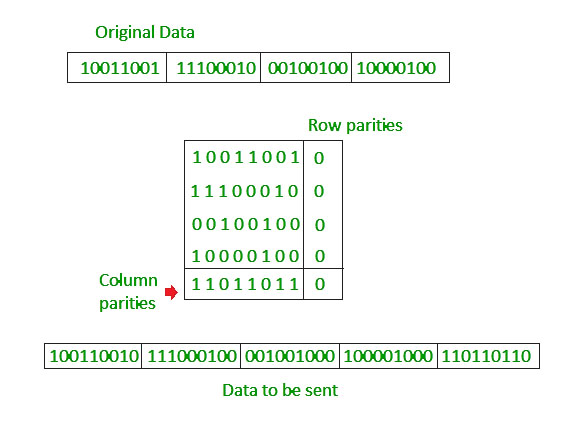

# Netwok ukazi
    
#### Sintaksa:
    ukaz [argumenti]

#### Ukazi:
- **ping:** previrjanje dosegljivosti
- **netstat:** prikaže aktivne povezave 
- **ipconfig (ip a):** nastavitve in konfiguracija NIC
- **hostname:** prikaže mrežno ime PC-ja
- **arp:** prikaže ARP tabelo/informacije
- **nslookup:** prikaže podatke v zvezi s DNS
- **traceroute (tracert):** prikaže sled prometa
- **getmac:** prikaže MAC naslove NIC-ov
- **route:** omogoča manipulacijo in prikaz usmerjevalne tabele

<br>

# ISO/OSI in TCP/IP

#### ISO/OSI
- **Aplication** : data
- **Presentation** : data
- **Session** : data
- **Transportation** : segment
- **Network** : packet
- **Data link** : frame
- **Pysical** : bit

#### TCP/IP
- **Aplication** : data
- **Transportation** : segment
- **Network** : packet
- **Network acess layer** : bit

## Fizična plast

### Naloga fizične plasti
- moduliranje bitov v signale
- prenos signala po prenosnem mediju
- določitev standardnih vmesnikov

### Osnovni pojmi
- Prenosni mediji
- Signal

### Smeri prenosa:
- **simplex** : enosmerno
- **half duplex** : izmenično dvosmerno
- **full duplex** : dvosmerno

### Tipi signalov
- **Analogni** : n stanji (odvisno na natančnost HW)
- **Digitalni** : 2 stanja

### Elektromagnetni signali
- Pasovna širina
- Spekter frekvenc

### A-D pretvorba
Pretvorba analognih signalov v digitalne signale

**Postopek:**
- vzorčenje signala
- dodelovanja binarne kode vzorčenemu signalu

### Neželjeni pojavi pri prenosu
- **Slabenje** : moč signala upada [dB]
- **Popačenje** : drugačna oblika signala
- **Šum** : motje na vodilu se mešajo s signalom

### Tipi network kablov
- **Bakreni:**
    - **UTP** : unshielded twisted pair
    - **STP** : shielded twisted pair
    - **FTP** : foiled twister pair
- **Koaksialni kabelj** : star/ne več v uporabi
- **Optični kabelj** : najnovejša tehnologija

### Tipi brezžičnih povezav
- Radijske 
- Mikrovalovne 
- Infrardeče
- Sateljitske

### Kodiranje
Spreminjanje signalov v pravo obliko.

**D -> A** = Modulacija

**A -> D** = Demodulacija

#### Modulacija:
- **AM** - **A**mplitude **M**odulation
- **FM** - **F**requency **M**odulation
- **PM** - **P**hase **M**odulation
- **QAM** - **Q**uadrature **A**mplitude **M**odulation


**AM in FM:**


**PM:**


**QAM:**


(Ne niti provat razumet kako to dela)

#### Digitalna kodiranja:
- **NRZ-L** - Non Return to Zero-Level
- **NRZI** - Non Return to Zero Inverted
- **Manchester**
- **Diferencialni Manchester**
- **in druga..**

#### Non Return Zero-Level (NRZ-L)
- Enka se kodira s pozitivnim nivojem
- Ničla se kodira s negativnim nivojem
- Slabost je sinhroniacija


#### Non Return Zero Inverted (NRZI)
- Ničla ne spremeni signala
- Enka obrne signal (invertira)


<hr>

#### Manchester
- Ničla obrne signal na negativno stanje (predhodno)
- Enka obrne signal na pozitivno stanje
- Uporablja se na LAN omrežjih
- IEEE 802.5

#### Diferenčni Manchester 
- Ničla prehoodi tudi na začetku intervala
- Enka ne prehodi na začetku intervala

Za oba Manchester velja da, se stanje spremeni na polovici trajanja signala.


**V Manchester si lahko predstavljamo stanja 1 in 0 tako:**


## Povezovalna plast

### Naloge povezovalne plasti
- okvirjanje datagramov
- zaznavanje in odpravljanje napak
- dostop do medija
- zagotavljanje zanesljive dostave
- kontrola pretoka

### Okvirjanje datagramov
Dodajanje repa in glave paketu iz višje plasti

Izgled okvirja:
**[glava]****[podatki]****[rep]**

### Zaznavanje in odpravljanje napak
#### Tehnike:
- **Parity bit**
    - doda se 1 ali 0 tako da je skupno št. enic paketa sodo oz. liho 
    - nevemo kje je prišlo do napake
    - če pride do 2 bit-flipa napake ne zaznamo
    
- **2D parity bit**
    - enako samo na več paketih skupaj
    - lahko zaznamo na katerem paketu je prišlo do napake
    

- **Hamming code**
    - Zazna in popravi napake na posameznih bitih tako, da podatkom doda dodatne paritetne bite. Uporablja specifičen vzorec paritetnih pregledov, ki so postavljeni na mesta, ki so potence števila 2 (1, 2, 4, 8 itd.), da omogoči zaznavanje in popravljanje napak. Če med prenosom pride do napake, koda izračuna sindrom, ki pomaga določiti točno napako in jo popraviti.
    

- **CRC (Cyclic Redundancy Check)**
    - Uporablja se na ETH
    - Matematična funkcija, ki temelji na polinomih.
    - Oznake:
        - M = message
        - P = polinom
        - m = stopnja polinoma
    - Postopek:
        1. ???
        2. ???
        3. ???

### Dostop do medija
#### Protokoli za delitev

- **TDMA**
    - ???
- **FDMA**
    - ???

#### Protokoli za nakjučni dostop

- **ALOHA**
    - Zgodnja 70. leta, Havaji
    - Vsak lahko oddaja okvir ko želi.
    - Samo 18% učinkovitosti
- **Slotted ALOHA**
    - Razdeljen čas oddajanja na enake intervale
    - Oddaja možna samo v intervalu
    - 37% učinkovitost
- **CSMA (Carrier Sense Multiple Access)**
    - Naprej se posluša in, ko je kanal prost se lahko oddaja
    - Če pride do kolizije se vsem napravam pošlje jam signal
- **CSMA/CD (Carrier Sense Multiple Access / Collision Detection)**
    - ???
    - Več kot 85% učinkovitost
- **CSMA/CA (Carrier Sense Multiple Access / Collision Avoidance)** 
    - ???
    - Uporablja se v brezžičnih omrežjih
    - RTC (Request To Send) "želim pošiljati"
    - CTS (Clear To Send) "lahko pošiljaš"

#### Protokoli za izmenični dostop
- **Poizvedovanje (polling)**
    - Centralno vozlišče poizveduje 
    - Rezervira si vsak čas naprej
- **Podajanje žetona (token passing)**
    - Oddaja samo tisti, ki ima žeton
    - Žeton se podaja med napravami

#### Zagotavljanje zanesljive dostave
- **Pozitivna potrditev (ACK)**
- **Negativna potrditev (NACK)**

#### Nadzor pretoka (flow control)
#### Protokoli:

- **XON/XOFF**
    - Prejeti paketi se dajo v čakalno vrsto
    - Ko je čakalna vrsta polna pošlje signal XOFF <- ustavi pošiljat
    - Ko se čakalna vrsta začne prazniti se pošlje XON <- začni pošiljat
- **Drseče okno (Sliding window)**
    - ???

## Omrežna plast
### Usmerjevalnik:
- Naprava v najvišji plasti kjer so naprave.
- Izavaja usmerjevanje in posredovanje
- Fowarding table -> odloča skozi katera vrata naj posreduje
- Deli omrežja na podomrežja

### Tipi omrežji
- **Povezalna omrežja(virtual channels)**
    - Ni IP naslovov ampak so števila vodov
    - Ko 2 napravi govorita je vod zaseden
- **Napovezalna omrežja (datagram, packet)**
    - Paket ima naslov, se posreduje do njega
    - Internet je paketno omrežje

### IP: Internet Protocol
- **IPv4 : Internet Protocol version 4**
    - 32b -> po 4 segmenti po 4b razdeljeni s "."
    - npr: 192.168.1.12
- **IPv6: Internet Protocol version 6**
    - 128b -> 16 segmentov po 16b v HEX št. sistemu razdeljeni s ":"
    - npr: AB12::879A:0:0:1233

#### Zgradba IP paketa


#### NAT: Network Adress Translation
```
192.168.1.12 -> 192.2.139.50 ........... 45.34.132.41 -> 192.168.1.12
                    NAT                      NAT
                192.168.1.1              192.168.1.1
```

#### ICMP: Internet Control Message Protocol
Nadzorna sporočila za omrežje:


## Transportna plast
**TCP** & **UDP**


## Aplikacijska plast
HTTP

proxy

ftp

dns

scp

<hr>

>#### Random pojmi:
>- TTL = time to live
>- MTU = Maximun Transmission Unit
>- Metric = v routing table pove koliko je vir zanesljiv (majnše kot je bolje je)
>- Modem = Modulator/Demodulator
>- Carrier signal = osnovni signal kateri nosi podatke
>- EDC (Error Detection Code) dodatni poslani biti namenjeni preverjanju pravilnosti
>- RTT = round trip time
>- XOR tabela
>   ```
>       X Y | X XOR Y
>       ---------------
>       0 0 | 0   
>       0 1 | 1
>       1 0 | 1
>       1 1 | 0 
>   ```
 